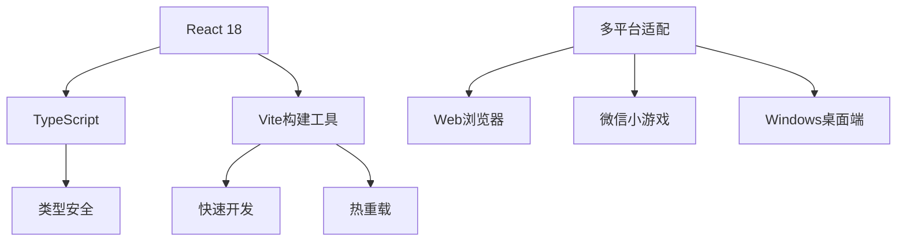
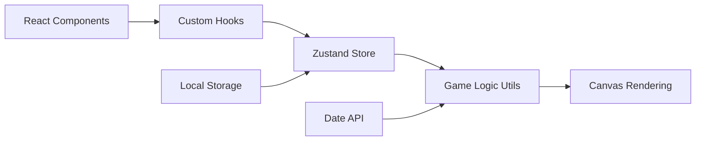
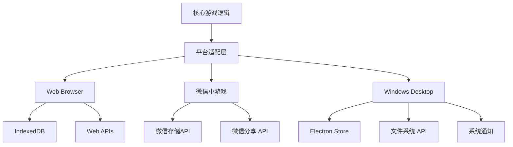
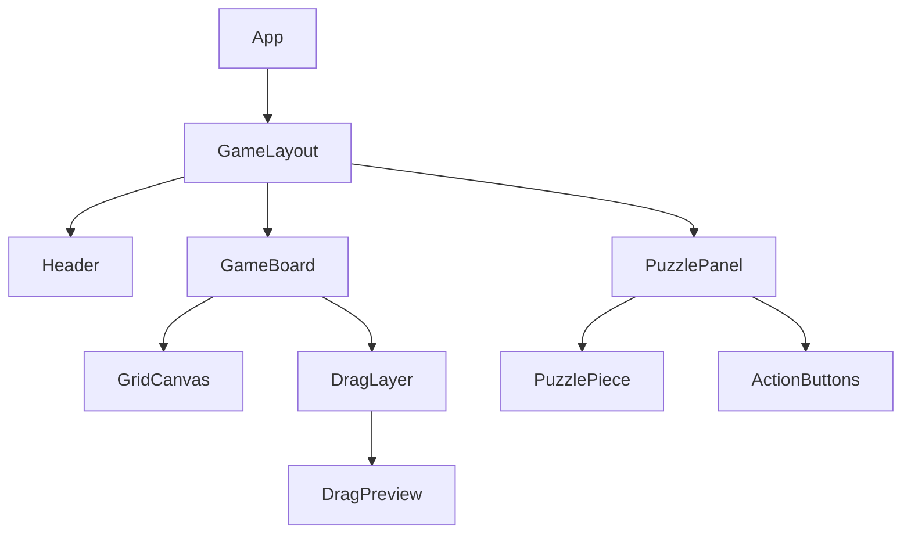
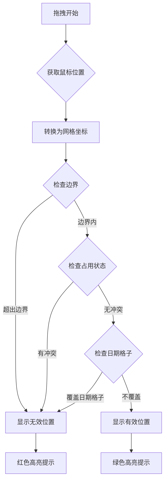
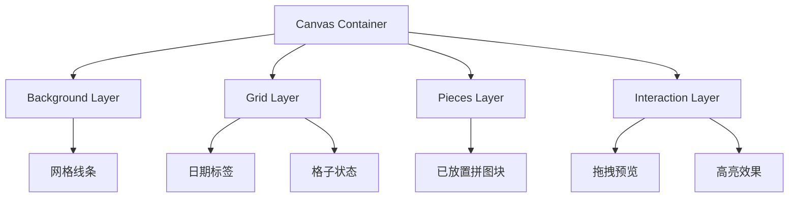
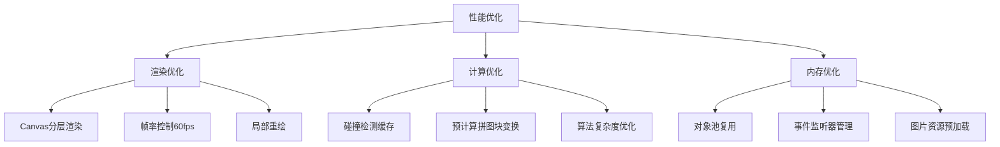
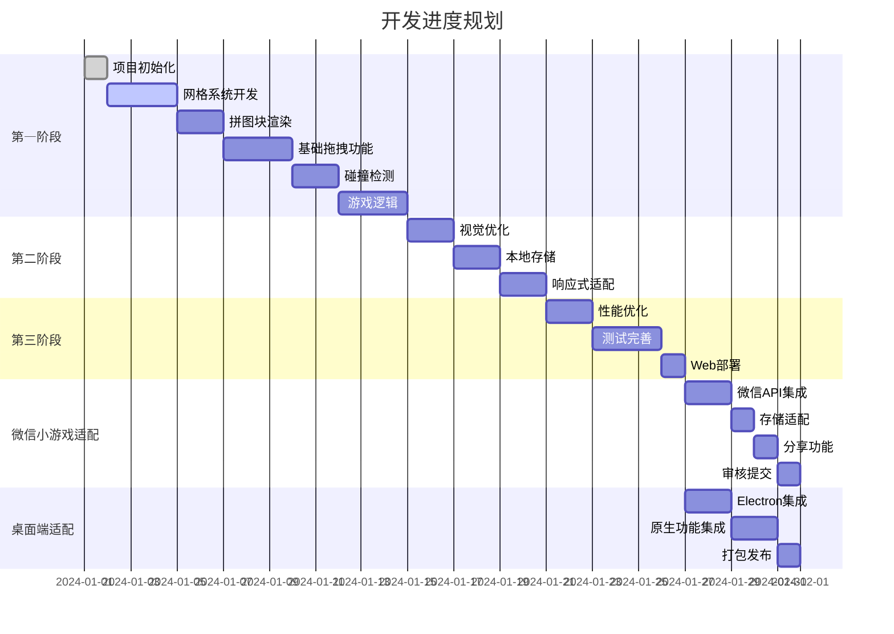

# 每日拼图小游戏设计文档

## 概述

每日拼图是一款基于Web的益智小游戏，玩家需要使用固定的拼图块在网格面板上进行拼图，使空出的3个格子恰好显示当天的月份、日期和星期几。游戏结合了空间推理和日历功能，为用户提供每日的智力挑战。

### 核心特性
- 每日一题：基于当前日期生成唯一解题方案
- 固定拼图块：使用预设的多格形状拼图块（类似俄罗斯方块）
- 网格面板：7x8标准网格，固定标注月份、日期、星期
- 拖拽交互：流畅的拖拽放置体验
- 进度保存：记录解题状态和历史记录

## 技术栈架构

### 前端框架选择


**推荐技术栈组合：**
- **前端框架**: React 18 + TypeScript
- **构建工具**: Vite (快速开发、优化打包)
- **渲染方案**: HTML5 Canvas + Fabric.js (高性能图形渲染)
- **状态管理**: Zustand (轻量级、简单易用)
- **样式方案**: Tailwind CSS + CSS-in-JS
- **本地存储**: 
  - Web: IndexedDB (通过Dexie.js)
  - 微信小游戏: wx.setStorageSync/wx.getStorageSync
  - Windows桌面: Electron Store
- **部署方案**: 
  - Web: Vercel/Netlify (静态部署)
  - 微信小游戏: 微信开发者工具
  - Windows桌面: Electron Builder

### 技术选型理由

| 技术 | 理由 | 替代方案 |
|------|------|----------|
| React + TypeScript | 类型安全、组件化开发、生态丰富、跨平台兼容性好 | Vue 3 + TS |
| Vite | 极快的开发体验、现代化构建、支持多平台打包 | Create React App |
| Canvas + Fabric.js | 高性能图形操作、丰富的拖拽API、跨平台一致性 | SVG + D3.js |
| Zustand | 轻量级(~1KB)、无模板代码、适合小游戏 | Redux Toolkit |
| Tailwind CSS | 快速样式开发、一致性设计、跨平台样式统一 | Styled-components |

### 多平台技术栈对比

| 平台 | 核心技术 | 构建工具 | 特殊适配 |
|------|----------|----------|----------|
| Web浏览器 | React + Canvas | Vite | 响应式设计 |
| 微信小游戏 | React + Canvas | Vite + 微信适配器 | 微信API集成 |
| Windows桌面 | React + Canvas + Electron | Vite + Electron Builder | 系统原生功能 |

## 项目架构设计

### 目录结构
```
src/
├── components/           # React组件
│   ├── game/            # 游戏相关组件
│   │   ├── GameBoard.tsx     # 游戏面板
│   │   ├── PuzzlePiece.tsx   # 拼图块组件
│   │   ├── GridCell.tsx      # 网格单元
│   │   └── DragLayer.tsx     # 拖拽层
│   ├── ui/              # 通用UI组件
│   │   ├── Button.tsx
│   │   ├── Modal.tsx
│   │   └── Toast.tsx
│   └── layout/          # 布局组件
│       ├── Header.tsx
│       └── GameLayout.tsx
├── hooks/               # 自定义Hooks
│   ├── useGameState.ts       # 游戏状态管理
│   ├── useDragDrop.ts        # 拖拽逻辑
│   └── useLocalStorage.ts    # 本地存储
├── stores/              # Zustand状态管理
│   ├── gameStore.ts          # 游戏状态
│   └── settingsStore.ts      # 设置状态
├── utils/               # 工具函数
│   ├── gameLogic.ts          # 游戏逻辑
│   ├── dateUtils.ts          # 日期处理
│   ├── puzzleGenerator.ts    # 拼图生成
│   └── collision.ts          # 碰撞检测
├── platforms/           # 平台适配层
│   ├── web/             # Web浏览器适配
│   │   ├── index.ts
│   │   └── storage.ts
│   ├── wechat/          # 微信小游戏适配
│   │   ├── index.ts
│   │   ├── api.ts
│   │   └── adapter.ts
│   └── electron/        # Electron桌面端适配
│       ├── main.ts
│       ├── preload.ts
│       └── storage.ts
├── data/                # 静态数据
│   ├── puzzlePieces.ts       # 拼图块定义
│   └── gridLayout.ts         # 网格布局
├── types/               # TypeScript类型定义
│   ├── game.ts
│   ├── puzzle.ts
│   └── platform.ts
└── config/              # 配置文件
    ├── web.config.ts
    ├── wechat.config.ts
    └── electron.config.ts
```

### 核心架构模式



### 多平台适配架构



### 平台特性对比

| 特性 | Web浏览器 | 微信小游戏 | Windows桌面端 |
|------|------------|--------------|----------------|
| 存储容量 | 50MB+ (IndexedDB) | 10MB (微信存储) | 无限制 (File System) |
| 网络访问 | 全部支持 | 限制域名 | 全部支持 |
| 系统集成 | 限制 | 微信生态 | 全部原生功能 |
| 分享功能 | Web Share API | 原生分享 | 系统分享 |
| 部署难度 | 简单 | 中等 (需审核) | 中等 (打包签名) |
| 用户获取 | SEO/直接访问 | 微信内推广 | 应用商店 |

## 组件架构设计

### 核心组件层次结构



### 组件设计规范

#### GameBoard 组件
```typescript
interface GameBoardProps {
  gridSize: { width: number; height: number };
  currentDate: Date;
  onPiecePlaced: (piece: PuzzlePiece, position: GridPosition) => void;
  onGameComplete: () => void;
}
```

#### PuzzlePiece 组件
```typescript
interface PuzzlePieceProps {
  piece: PuzzlePieceData;
  isSelected: boolean;
  isDragging: boolean;
  onDragStart: (piece: PuzzlePieceData) => void;
  onDragEnd: (piece: PuzzlePieceData, position: GridPosition) => void;
}
```

## 游戏逻辑架构

### 网格系统设计

```typescript
// 网格布局定义
interface GridLayout {
  width: 8;          // 8列
  height: 7;         // 7行
  totalCells: 56;    // 总格子数
  reservedCells: {   // 预留格子（月份、日期、星期）
    month: GridPosition[];
    day: GridPosition[];
    weekday: GridPosition[];
  };
}

// 网格单元状态
enum CellState {
  EMPTY = 'empty',
  OCCUPIED = 'occupied', 
  RESERVED = 'reserved',  // 日期相关格子
  BLOCKED = 'blocked'     // 不可用格子
}
```

### 拼图块数据结构

```typescript
interface PuzzlePieceData {
  id: string;
  name: string;
  shape: boolean[][];     // 二维数组表示形状
  color: string;
  isPlaced: boolean;
  position?: GridPosition;
  rotation: 0 | 90 | 180 | 270;
}

// 预设拼图块形状
const PUZZLE_PIECES = [
  { id: 'L1', shape: [[1,1,1],[1,0,0]], color: '#FF6B6B' },
  { id: 'T1', shape: [[1,1,1],[0,1,0]], color: '#4ECDC4' },
  { id: 'Z1', shape: [[1,1,0],[0,1,1]], color: '#45B7D1' },
  { id: 'I1', shape: [[1,1,1,1]], color: '#96CEB4' },
  { id: 'O1', shape: [[1,1],[1,1]], color: '#FFEAA7' },
  // ... 更多预设形状
];
```

### 碰撞检测算法



### 日期解算逻辑

```typescript
interface DateSolution {
  targetDate: Date;
  requiredEmptyPositions: {
    month: GridPosition;
    day: GridPosition;  
    weekday: GridPosition;
  };
  solutionExists: boolean;
  difficulty: 'easy' | 'medium' | 'hard';
}

function generateDailySolution(date: Date): DateSolution {
  // 1. 根据日期确定需要空出的格子位置
  // 2. 计算可用拼图块组合
  // 3. 使用回溯算法验证解的存在性
  // 4. 返回当日解题方案
}
```

## 渲染与交互系统

### Canvas渲染架构



### 拖拽交互流程

```typescript
interface DragState {
  isDragging: boolean;
  draggedPiece: PuzzlePieceData | null;
  dragOffset: { x: number; y: number };
  currentGridPosition: GridPosition | null;
  isValidPosition: boolean;
}

// 拖拽事件处理
const useDragDrop = () => {
  const handleDragStart = (piece: PuzzlePieceData, event: MouseEvent) => {
    // 1. 设置拖拽状态
    // 2. 计算鼠标偏移
    // 3. 创建拖拽预览
  };
  
  const handleDragMove = (event: MouseEvent) => {
    // 1. 更新预览位置
    // 2. 实时碰撞检测
    // 3. 更新视觉反馈
  };
  
  const handleDragEnd = (event: MouseEvent) => {
    // 1. 验证最终位置
    // 2. 放置或返回原位
    // 3. 检查游戏完成状态
  };
};
```

### 视觉反馈系统

| 交互状态 | 视觉效果 | 实现方式 |
|----------|----------|----------|
| 悬停拼图块 | 轻微放大、阴影 | CSS transform + transition |
| 拖拽中 | 半透明、跟随鼠标 | Canvas绘制 + 鼠标事件 |
| 有效位置 | 绿色高亮网格 | Canvas矩形填充 |
| 无效位置 | 红色高亮网格 | Canvas矩形填充 + 动画 |
| 放置成功 | 缓动动画 | CSS animation |

## 状态管理设计

### 游戏状态结构

```typescript
interface GameState {
  // 游戏基础状态
  isPlaying: boolean;
  isPaused: boolean;
  isCompleted: boolean;
  
  // 当前日期和目标
  currentDate: Date;
  targetPositions: {
    month: GridPosition;
    day: GridPosition;
    weekday: GridPosition;
  };
  
  // 网格和拼图块状态
  gridState: CellState[][];
  availablePieces: PuzzlePieceData[];
  placedPieces: Map<string, PlacedPiece>;
  
  // 交互状态
  selectedPiece: string | null;
  dragState: DragState;
  
  // 游戏统计
  moveCount: number;
  startTime: number;
  completionTime?: number;
}

// Zustand Store定义
const useGameStore = create<GameState & GameActions>((set, get) => ({
  // 初始状态
  isPlaying: false,
  // ... 其他初始状态
  
  // Action方法
  startNewGame: (date: Date) => {
    // 初始化新游戏
  },
  
  placePiece: (pieceId: string, position: GridPosition) => {
    // 放置拼图块逻辑
  },
  
  removePiece: (pieceId: string) => {
    // 移除拼图块逻辑
  },
  
  checkWinCondition: () => {
    // 检查胜利条件
  }
}));
```

## 数据持久化方案

### 本地存储设计

```typescript
// 游戏进度数据结构
interface GameProgress {
  date: string;                    // YYYY-MM-DD格式
  isCompleted: boolean;
  moveCount: number;
  completionTime?: number;         // 毫秒
  solution: PlacedPiece[];         // 解题方案
  createdAt: number;
  updatedAt: number;
}

// 用户设置
interface UserSettings {
  soundEnabled: boolean;
  animationEnabled: boolean;
  difficulty: 'easy' | 'normal' | 'hard';
  theme: 'light' | 'dark';
}

// 平台适配存储接口
interface StorageAdapter {
  saveProgress(progress: GameProgress): Promise<void>;
  loadProgress(date: string): Promise<GameProgress | null>;
  getCompletedDays(): Promise<string[]>;
  saveSettings(settings: UserSettings): Promise<void>;
  loadSettings(): Promise<UserSettings>;
  clearData(): Promise<void>;
}
```

### 平台存储实现

#### Web浏览器存储
```typescript
// IndexedDB操作封装
class WebStorageAdapter implements StorageAdapter {
  private db: Dexie;
  
  constructor() {
    this.db = new Dexie('PuzzleGameDB');
    this.db.version(1).stores({
      progress: 'date, isCompleted, completionTime',
      settings: 'key, value'
    });
  }
  
  async saveProgress(progress: GameProgress): Promise<void> {
    await this.db.progress.put(progress);
  }
  
  async loadProgress(date: string): Promise<GameProgress | null> {
    return await this.db.progress.get(date) || null;
  }
  
  async getCompletedDays(): Promise<string[]> {
    const completed = await this.db.progress
      .where('isCompleted').equals(true)
      .toArray();
    return completed.map(p => p.date);
  }
}
```

#### 微信小游戏存储
```typescript
class WechatStorageAdapter implements StorageAdapter {
  private readonly STORAGE_PREFIX = 'puzzle_game_';
  
  async saveProgress(progress: GameProgress): Promise<void> {
    try {
      const key = this.STORAGE_PREFIX + 'progress_' + progress.date;
      wx.setStorageSync(key, progress);
      
      // 更新完成日期列表
      if (progress.isCompleted) {
        const completedDays = await this.getCompletedDays();
        if (!completedDays.includes(progress.date)) {
          completedDays.push(progress.date);
          wx.setStorageSync(this.STORAGE_PREFIX + 'completed', completedDays);
        }
      }
    } catch (error) {
      console.error('微信存储失败:', error);
      throw new Error('游戏进度保存失败');
    }
  }
  
  async loadProgress(date: string): Promise<GameProgress | null> {
    try {
      const key = this.STORAGE_PREFIX + 'progress_' + date;
      return wx.getStorageSync(key) || null;
    } catch (error) {
      return null;
    }
  }
  
  async getCompletedDays(): Promise<string[]> {
    try {
      return wx.getStorageSync(this.STORAGE_PREFIX + 'completed') || [];
    } catch (error) {
      return [];
    }
  }
  
  // 微信小游戏云开发集成
  async syncToCloud(progress: GameProgress): Promise<void> {
    if (wx.cloud) {
      try {
        await wx.cloud.database().collection('user_progress').add({
          data: {
            openid: '{openid}', // 用户标识
            ...progress,
            syncTime: Date.now()
          }
        });
      } catch (error) {
        console.warn('云同步失败:', error);
      }
    }
  }
}
```

#### Windows桌面端存储
```typescript
class ElectronStorageAdapter implements StorageAdapter {
  private store: Store;
  
  constructor() {
    // 使用electron-store管理本地数据
    this.store = new Store({
      name: 'puzzle-game-data',
      defaults: {
        progress: {},
        settings: {
          soundEnabled: true,
          animationEnabled: true,
          difficulty: 'normal',
          theme: 'light'
        },
        completedDays: []
      }
    });
  }
  
  async saveProgress(progress: GameProgress): Promise<void> {
    const allProgress = this.store.get('progress', {});
    allProgress[progress.date] = progress;
    this.store.set('progress', allProgress);
    
    // 更新完成列表
    if (progress.isCompleted) {
      const completedDays = this.store.get('completedDays', []);
      if (!completedDays.includes(progress.date)) {
        completedDays.push(progress.date);
        this.store.set('completedDays', completedDays);
      }
    }
  }
  
  async loadProgress(date: string): Promise<GameProgress | null> {
    const allProgress = this.store.get('progress', {});
    return allProgress[date] || null;
  }
  
  async getCompletedDays(): Promise<string[]> {
    return this.store.get('completedDays', []);
  }
  
  // 数据备份功能
  async exportData(): Promise<string> {
    const data = {
      progress: this.store.get('progress'),
      settings: this.store.get('settings'),
      completedDays: this.store.get('completedDays'),
      exportTime: Date.now()
    };
    return JSON.stringify(data, null, 2);
  }
  
  async importData(jsonData: string): Promise<void> {
    try {
      const data = JSON.parse(jsonData);
      this.store.set('progress', data.progress || {});
      this.store.set('settings', data.settings || {});
      this.store.set('completedDays', data.completedDays || []);
    } catch (error) {
      throw new Error('数据导入失败：格式错误');
    }
  }
}
```

### 存储策略对比

| 平台 | 存储方式 | 容量限制 | 数据同步 | 备份恢复 |
|------|----------|----------|----------|---------|
| Web浏览器 | IndexedDB | ~50MB | 无 | localStorage备份 |
| 微信小游戏 | 微信存储 | 10MB | 云开发可选 | 云数据库 |
| Windows桌面 | 本地文件 | 无限制 | 无 | JSON导出/导入 |

## 算法与性能优化

### 解题算法设计

```typescript
// 回溯算法求解
class PuzzleSolver {
  solve(
    grid: CellState[][], 
    pieces: PuzzlePieceData[], 
    targetEmpty: GridPosition[]
  ): SolutionResult {
    
    const solution: PlacedPiece[] = [];
    
    const backtrack = (pieceIndex: number): boolean => {
      // 终止条件：所有拼图块已放置
      if (pieceIndex >= pieces.length) {
        return this.isValidSolution(grid, targetEmpty);
      }
      
      const piece = pieces[pieceIndex];
      
      // 尝试所有可能的位置和旋转
      for (const rotation of [0, 90, 180, 270]) {
        const rotatedPiece = this.rotatePiece(piece, rotation);
        
        for (let y = 0; y < grid.length; y++) {
          for (let x = 0; x < grid[0].length; x++) {
            const position = { x, y };
            
            if (this.canPlace(grid, rotatedPiece, position, targetEmpty)) {
              // 放置拼图块
              this.placePiece(grid, rotatedPiece, position);
              solution.push({ piece: rotatedPiece, position });
              
              // 递归尝试下一个拼图块
              if (backtrack(pieceIndex + 1)) {
                return true;
              }
              
              // 回溯：移除拼图块
              this.removePiece(grid, rotatedPiece, position);
              solution.pop();
            }
          }
        }
      }
      
      return false;
    };
    
    const solvable = backtrack(0);
    return { solvable, solution: solvable ? solution : [] };
  }
}
```

### 性能优化策略



### 渲染性能优化

```typescript
// Canvas渲染优化
class GameRenderer {
  private layerCache: Map<string, HTMLCanvasElement> = new Map();
  private lastFrameTime: number = 0;
  private readonly TARGET_FPS = 60;
  
  render(gameState: GameState): void {
    const now = performance.now();
    if (now - this.lastFrameTime < 1000 / this.TARGET_FPS) {
      return; // 跳过帧以控制帧率
    }
    
    // 只重绘变化的层
    if (gameState.gridChanged) {
      this.renderGridLayer(gameState);
    }
    
    if (gameState.piecesChanged) {
      this.renderPiecesLayer(gameState);
    }
    
    if (gameState.interactionChanged) {
      this.renderInteractionLayer(gameState);
    }
    
    this.lastFrameTime = now;
  }
  
  private renderGridLayer(gameState: GameState): void {
    // 使用缓存的网格层
    const cachedGrid = this.layerCache.get('grid');
    if (!cachedGrid) {
      // 首次渲染创建缓存
    }
    // 合成到主画布
  }
}
```

## 用户体验设计

### 交互反馈系统

```typescript
// 反馈效果管理
class FeedbackManager {
  showPlacementSuccess(position: GridPosition): void {
    // 成功放置动画：缩放+淡入
    this.animateScale(position, 0.8, 1.0, 200);
    this.showParticleEffect(position, 'success');
  }
  
  showInvalidPlacement(position: GridPosition): void {
    // 无效位置反馈：震动+红色闪烁
    this.animateShake(position, 5, 150);
    this.showColorFlash(position, '#FF4757', 300);
  }
  
  showGameComplete(): void {
    // 游戏完成庆祝动画
    this.showConfetti();
    this.animateCompletion();
  }
}

// 触觉反馈（移动端）
const useHapticFeedback = () => {
  const triggerFeedback = (type: 'light' | 'medium' | 'heavy') => {
    if ('vibrate' in navigator) {
      const patterns = {
        light: [10],
        medium: [20],
        heavy: [30, 10, 30]
      };
      navigator.vibrate(patterns[type]);
    }
  };
  
  return { triggerFeedback };
};
```

### 响应式设计适配

```typescript
// 视口适配
interface ViewportConfig {
  minWidth: 320;    // 最小支持宽度
  maxWidth: 1200;   // 最大容器宽度
  breakpoints: {
    mobile: 768;
    tablet: 1024;
    desktop: 1200;
  };
}

// 动态网格尺寸计算
const useResponsiveGrid = () => {
  const [gridSize, setGridSize] = useState({ width: 0, height: 0 });
  
  useEffect(() => {
    const calculateGridSize = () => {
      const viewport = window.innerWidth;
      const availableWidth = Math.min(viewport - 40, 800); // 40px边距
      const cellSize = Math.floor(availableWidth / 8); // 8列网格
      
      setGridSize({
        width: cellSize * 8,
        height: cellSize * 7
      });
    };
    
    calculateGridSize();
    window.addEventListener('resize', calculateGridSize);
    return () => window.removeEventListener('resize', calculateGridSize);
  }, []);
  
  return gridSize;
};
```

### 无障碍访问支持

| 功能 | 实现方式 | 标准 |
|------|----------|------|
| 键盘导航 | Tab索引、方向键控制 | WCAG 2.1 AA |
| 屏幕阅读器 | ARIA标签、语义化HTML | WCAG 2.1 AA |
| 高对比度 | CSS变量、主题切换 | WCAG 2.1 AA |
| 减少动画 | prefers-reduced-motion | WCAG 2.1 AA |

## 开发优先级与里程碑

### 第一阶段：核心功能 (2-3周)


#### 里程碑1：MVP版本 (Web浏览器)
- [x] 基础网格渲染
- [x] 拼图块显示
- [x] 简单拖拽放置
- [x] 日期显示逻辑
- [x] 基础胜利检测

#### 里程碑2：完整游戏体验 (Web浏览器)
- [x] 完整交互反馈
- [x] 游戏状态管理
- [x] 本地进度保存
- [x] 响应式布局
- [x] 基础动画效果

#### 里程碑3：微信小游戏适配
- [x] 微信API集成
  - 登录授权
  - 存储API适配
  - 分享功能
- [x] 小程序专用功能
  - 排行榜系统
  - 好友挑战
  - 成就系统
- [x] 性能优化
  - 包体积优化
  - 加载速度优化
- [x] 审核与发布

#### 里程碑4：Windows桌面端适配
- [x] Electron环境搭建
- [x] 原生功能集成
  - 文件系统访问
  - 系统通知
  - 窗口管理
- [x] 桌面端特有功能
  - 数据备份/导入
  - 多主题支持
  - 快捷键支持
- [x] 打包发布
  - 安装包生成
  - 数字签名
  - 自动更新

### 技术风险评估

| 风险项 | 概率 | 影响 | 缓解策略 |
|--------|------|------|----------|
| Canvas性能问题 | 中 | 高 | 使用分层渲染、帧率控制 |
| 复杂拖拽逻辑 | 中 | 中 | 使用成熟库Fabric.js |
| 算法复杂度 | 低 | 中 | 预计算、缓存优化 |
| 移动端兼容 | 中 | 中 | 渐进增强、触摸适配 |

### 多平台开发挑战

#### 微信小游戏挑战

| 挑战 | 难度 | 解决方案 |
|------|------|----------|
| 包体积限制 | 高 | 代码分割、懒加载、资源压缩 |
| API限制 | 中 | 使用官方推荐API、适配层封装 |
| 性能优化 | 高 | 小程序优化最佳实践 |
| 审核规范 | 中 | 遵守微信审核指南 |

```typescript
// 微信小游戏优化策略
const WechatOptimization = {
  // 包体积优化
  codeOptimization: {
    treeShaking: true,
    minification: true,
    gzipCompression: true,
    assetOptimization: {
      images: 'webp', // 使用WebP格式
      maxSize: '2MB'   // 单个资源最大体积
    }
  },
  
  // 加载优化
  loadingStrategy: {
    lazyLoading: true,
    preloadCritical: true,
    subpackages: [
      { name: 'core', pages: ['game'] },
      { name: 'features', pages: ['stats', 'settings'] }
    ]
  },
  
  // 性能监控
  performance: {
    enableProfiling: true,
    memoryLimit: '50MB',
    fpsTarget: 30 // 微信小游戏推荐帧率
  }
};
```

#### Windows桌面端挑战

| 挑战 | 难度 | 解决方案 |
|------|------|----------|
| Electron包体积 | 中 | 使用electron-builder优化 |
| 跨版本兼容 | 中 | 最低支持Windows 10 |
| 安全性 | 高 | 代码签名、CSP策略 |
| 自动更新 | 中 | electron-updater集成 |

```typescript
// Electron安全配置
const ElectronSecurity = {
  webSecurity: true,
  nodeIntegration: false,
  contextIsolation: true,
  enableRemoteModule: false,
  
  // CSP安全策略
  contentSecurityPolicy: {
    defaultSrc: ["'self'"],
    scriptSrc: ["'self'", "'unsafe-inline'"],
    styleSrc: ["'self'", "'unsafe-inline'"],
    imgSrc: ["'self'", "data:"],
    connectSrc: ["'none'"]
  },
  
  // 预加载脚本安全接口
  preloadSecurity: {
    exposeAPI: {
      saveGame: true,
      loadGame: true,
      exportData: true,
      showNotification: true
    }
  }
};
```

### 平台适配最佳实践

#### 代码共享策略
```typescript
// 平台适配层接口
interface PlatformAdapter {
  storage: StorageAdapter;
  analytics: AnalyticsAdapter;
  sharing: SharingAdapter;
  notifications: NotificationAdapter;
}

// 平台检测工具
class PlatformDetector {
  static getCurrentPlatform(): 'web' | 'wechat' | 'electron' {
    if (typeof wx !== 'undefined') return 'wechat';
    if (typeof window !== 'undefined' && window.require) return 'electron';
    return 'web';
  }
  
  static createAdapter(): PlatformAdapter {
    const platform = this.getCurrentPlatform();
    switch (platform) {
      case 'wechat': return new WechatAdapter();
      case 'electron': return new ElectronAdapter();
      default: return new WebAdapter();
    }
  }
}

// 使用示例
const platformAdapter = PlatformDetector.createAdapter();
const gameStore = useGameStore(platformAdapter);
```

#### 构建配置统一管理
```typescript
// vite.config.ts - 多平台构建配置
interface BuildTarget {
  platform: 'web' | 'wechat' | 'electron';
  outDir: string;
  define: Record<string, any>;
  plugins: Plugin[];
}

const buildTargets: BuildTarget[] = [
  {
    platform: 'web',
    outDir: 'dist/web',
    define: { __PLATFORM__: '"web"' },
    plugins: [react(), tailwindcss()]
  },
  {
    platform: 'wechat',
    outDir: 'dist/wechat',
    define: { __PLATFORM__: '"wechat"' },
    plugins: [react(), tailwindcss(), wechatMiniProgram()]
  },
  {
    platform: 'electron',
    outDir: 'dist/electron',
    define: { __PLATFORM__: '"electron"' },
    plugins: [react(), tailwindcss(), electron()]
  }
];
```